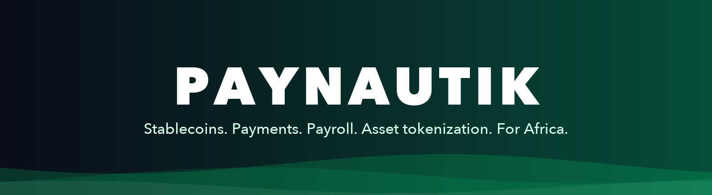

### Money that moves like information.

  A financial platform for Africa: stablecoin wallets, cross-border payments, payroll, savings and real-world asset tokenization, built on Hedera for fast, low-fee, on-chain settlement.

  <a href="https://paynautik.com">Website</a> ·
  <a href="https://paynautik.com/developer">Developers</a> ·
  <a href="https://paynautik.com/about">About</a> ·
  <a href="https://paynautik.com/press">Press</a> ·
  <a href="mailto:support@paynautik.com">Contact</a>

---

## What we build

| | |
|---|---|
| **Stablecoin wallet & payments** | Send and receive money across borders in seconds, with low fees |
| **Paynautik Ledger** | Every balance recorded in our own double-entry ledger, with settlement on Hedera, the XRP Ledger and Stellar |
| **Global payroll** | Automate salary payouts in multiple currencies, with no hidden fees |
| **Smart escrow** | Funds released only when milestones are met, with built-in arbitration |
| **Group savings** | Pool funds with your community: automated contributions and transparent management |
| **Asset tokenization** | Fractionalize real-world assets such as property, commodities and art into tradable tokens |
| **Paynautik Business** | Connect your sales channels, automate finance and get AI-powered insights |

## Our projects

| Project | What it is |
|---|---|
| [**OpenReserve**](https://github.com/Paynautik/openreserve) | The Internet Financial Protocol: an open protocol for moving value as seamlessly as the Internet moves information. Open source. |
| [**gabis**](https://gabispay.com) | The AI agent that gets African businesses paid: collections, invoices, a multi-currency wallet and stablecoin settlement. |
| **Paynautik platform** | The backend and apps behind [paynautik.com](https://paynautik.com): wallet, ledger, escrow, payroll and tokenization services. |

## Built on

**Hedera** · **XRP Ledger** · **Stellar** · **TypeScript** · **PostgreSQL** · **Kafka**

## Get involved

- **Build with us:** read the [developer docs](https://paynautik.com/developer) and star [OpenReserve](https://github.com/Paynautik/openreserve).
- **Join the team:** see [open roles](https://paynautik.com/careers).
- **Talk to us:** [support@paynautik.com](mailto:support@paynautik.com)

Paynautik is a financial technology company, not a bank. Product names and figures on this page are descriptive and not an offer of financial services.

